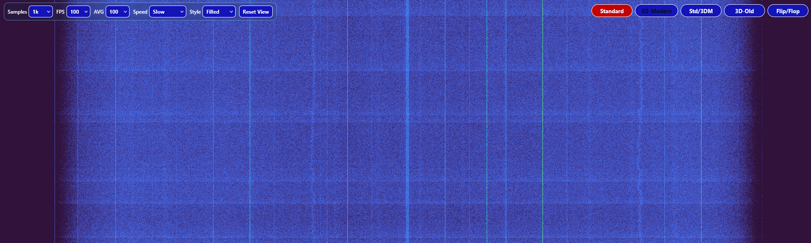
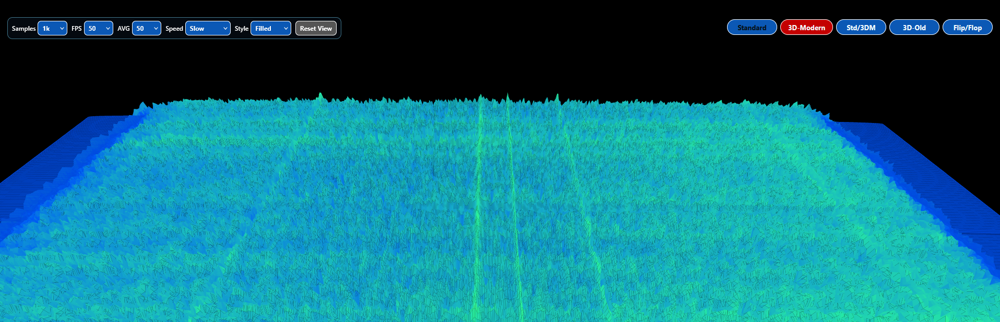
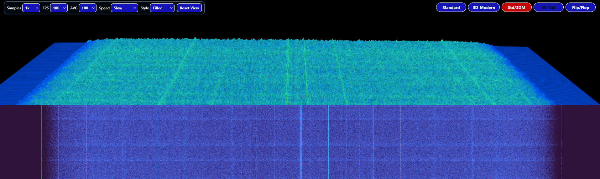
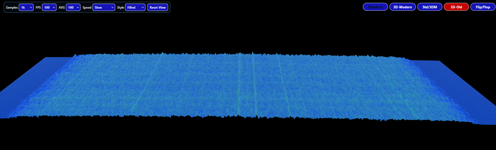

## 🌊 Waterfall Modes

### 📡 Standard


### 🎨 3D Modern


### 🧩 Split Mode (Standard + 3D)


### 🧊 3D Old
# OWRXP-DNX-Waterfall

Public standalone DNX waterfall module for OpenWebRX+.

This repo is for people who want the DNX waterfall experience without taking the full DNX receiver-panel runtime overlay and without taking the noVNC layer.

Companion repos:

- [OWRXP-DNX](https://github.com/KanotixPinguin/OWRXP-DNX) for the full DNX overlay
- [OWRXP-DNX-noVNC](https://github.com/KanotixPinguin/OWRXP-DNX-noVNC) for the desktop-access variant

## What It Adds

This module focuses on the waterfall presentation only:

- `Standard`
- `3D-Modern`
- `Std/3DM`
- `3D-Old`
- `Flip/Flop`
- left-side waterfall settings
- saved 3D view state

## Scope

- public OpenWebRX+ base from `luarvique/ppa`
- injection of the DNX 3D waterfall block into `plugins/receiver/init.js`
- no private station settings
- no LoRa-specific station data
- no noVNC layer

## How It Works

The repo contains the extracted waterfall block from the live DNX `init.js`:

- [patches/waterfall/owrx_3d_waterfall.js](C:/Users/ich/Documents/OWRX%20Codex/OWRXP-DNX-Waterfall/patches/waterfall/owrx_3d_waterfall.js)

and a patch script that injects or replaces that block inside:

- `/usr/lib/python3/dist-packages/htdocs/plugins/receiver/init.js`

## Build

```sh
docker build -f docker/Dockerfile -t owrxp-dnx-waterfall:test .
```

## Run

```sh
docker run --rm -p 8073:8073 --name owrxp-dnx-waterfall owrxp-dnx-waterfall:test
```

Then open:

- `http://SERVER-IP:8073`

## Public Safety

This repo intentionally avoids:

- private IPs
- private receiver keys
- embedded private noVNC links
- private station identity data

## Status

This repo is the lightweight public waterfall-only variant.
